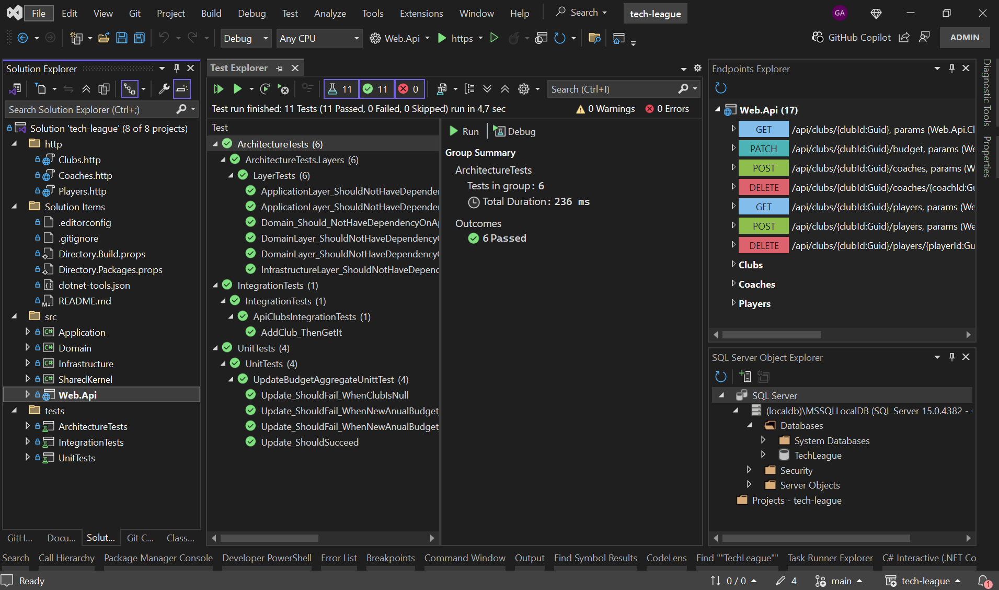
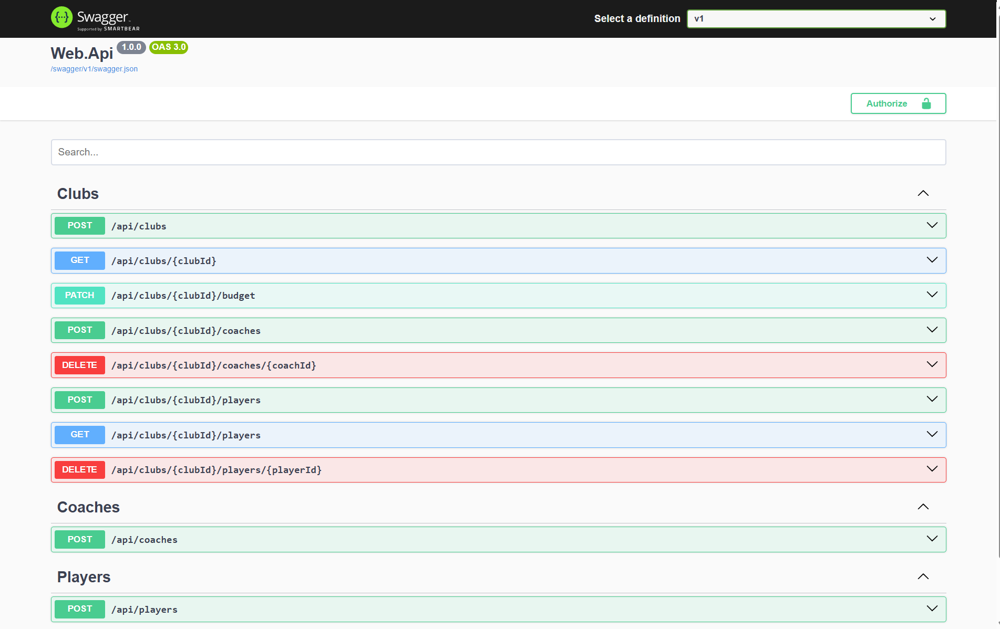
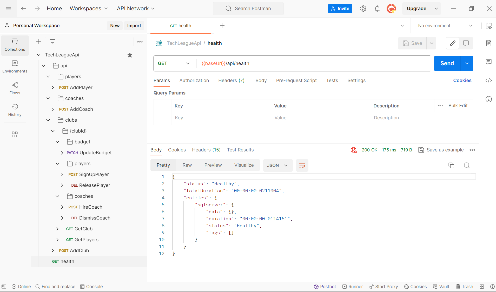

# 🚀 Tech League Web Api

This guide explains how to build, run, test, and publish a **Tech League Web API** using the **.NET CLI**.

---

## 🧰 Prerequisites

Make sure you have installed:

- git
- dotnet
- **.NET SDK 10.0**

Open a console and run following command

```bash
git clone https://github.com/agutierrezcu/tech-league.git

cd tech-league
dotnet tool restore

dotnet restore
dotnet build -c Release
dotnet publish ./src/Web.Api/Web.Api.csproj -c Release -o ./publish

cd publish
dotnet Web.Api.dll
```

Copy from console the server url for further actions (http://localhost:5000 by default)

**Note:** Postaman collection has a {{baseUrl}} variable at collection level which initial value
is http://localhost:5000

- Make sure everything is working as expected by
    - Open swagger UI -> browser: {{baseUrl}}/swagger/index.html
    - Checking health -> GET {{baseUrl}}/api/health

# First execution

## Data seeding

It will be performed right after first time application runs and You will get some data such as below

```text
5 clubs (Barcelona, Real Madrid, Atlético, Sevilla, Betis)
8 players (Messi, Neymar, Xavi, Iniesta, Ronaldo, Mbappe, Benzema, Raul)
4 coaches (Guardiola, Ancelloti, Klopp, Simone)
```

Four players are playing for Barcelona club and the rest for Real Madrid.

Barcelona is being coached by Guardiola and Real Madrid by Ancelloti

The data setup makes you able to call GetPlayers endpoint using url bellow getting player playing for Barcelona and Real
Madrid:

```bash
GET {{baseUrl}}/api/clubs/{{clubId}}/players?filterByName=&page=1&pageSize=2
```

In roder to get actual ids for mentioned clubs execute the query below

```sql
select Id, Name
from Clubs
where ThreeLettersName = 'FCB' or ThreeLettersName = 'RMA'
```

**Note: Seeding implementation aims to meet all functional requirements.!! Even thougt, some check constrains have been
added along with migrations to enforce business rules at persistence layer.**

Besides, If you inspect response headers you will see additional information regarding query results

```csharp
public const string TotalCount = "X-Total-Count";
public const string PageNumber = "X-Page-Number";
public const string PageSize = "X-Page-Size";
public const string TotalPages = "X-Total-Pages";
public const string HasNext = "X-Has-Next-Page";
public const string HasPrevious = "X-Has-Previous-Page";
```

For any further operation depending on data persisted feel free to look into DDBB. You can find connection string in
appsettings.json file in ./src/Web.Api

```json
 "ConnectionStrings": {
   "TechLeagueDDBB": "Server=(localdb)\\mssqllocaldb;Database=TechLeague;Trusted_Connection=True;MultipleActiveResultSets=true"
 }
```

# Postman collection v2.1

Placed in ./tools/postman/TechLeagueApi.postman_collection.json

"AddClub", "AddCoach" and "AddPlayer" endpoints a "Location" header with the route where resource can be obtined.

The id values returned as part of the location header are set as a collection variable with the name "clubId", "coachId"
and "playerId" using them further calls.

**Note:** The values for those variables will correspond to the id returned in last calls

In most cases properties' values in request payload are been generated using {{$random...}} variables. Sometimes some
values might not meet validation rules. You can keeping trying :) or feel free to set fixed values.

Recommended flows execution from postman would be

    Start with AddClub
        Then -> as many times as you want  (it will depend on club's budget)
            AddPlayer -> SignUpPlayer (if try to signup the same player again you will get error code "PlayedAlreadySigned")
            AddCoach -> HireCoach (if try to hire the same coach again you will get error code "CoachAlreadyHired")

    Then 
        GetPlayers (query players by club)
        UpdateBudget
        ReleasePlayer (the last one created) -> SignUpPlayer (sign him up again :D)
        DismissCoach (the last one created) -> HireCoach (hire him again :D)

# DataBase

All database related features are performed using SQL Server LocalDB (for simplicity).

## Migrations

**Infrastructure** project holds **Migrations** and its own appsettings.json file with a setting targeting connection
string to be used during database operations.

```json
{
  "ConnectionStrings": {
    "DesignTimeTechLeagueDDBB": "..."
  }
}
```

# Development Environment

## Visual Studio Professional 2022



## Swagger UI



## Postman



# Tooling

Examples of request to consume endpoints in a quick and easy way during development. Http client files base are placed
in ./tools/http.

    Clubs.http
    Coaches.http
    Players.http

# Insights

#### .Net10

Combine the use of StronglyTypedId with automatic generation sortable Guid values as identities useful for distributed
environment avoiding collisions.

- .Net10.0 supports sortable Guid generatios (Guid.CreateVersion7())
    - Before version 9 NewId library was (and it's still) a viable alternative https://github.com/phatboyg/NewId

- Strongly typed ids creation is straigthfoward using source generators out of the box
    - Avoid primitive obsesion
    - Brings more clarity to public contracts and domain understanding
    - Useful resource https://andrewlock.net/series/using-strongly-typed-entity-ids-to-avoid-primitive-obsession/

#### AspNet Core 10

- Health checks (GET {{baseUrl}}/api/health)
    - Data base

- Validation & Logging
    - Implemented as a cross cutting concern in presentation and application layers
    - Information regarding command handler, query handler and event handler execution is logged using decorators.

- Configuration
    - Adding validation to strongly typed configuration
    - Validate on start application
    - FluentValidations package integration

- Adding security headers

- Fastendpoint https://fast-endpoints.com/ (REPR)
    - Validation
    - Exception / Error handling
    - ProblemDetails
    - OpenApi / SwaggerUI

- HashId (pending)

- CorrelationId (pending)
    - requestid -> commandid -> aggregateid -> eventid
    - requestid -> queryid
    - eventid -> commandid -> -> aggregateid -> eventid

- BackgroundJobs
    - Mediate between published domain events through in-memory bus and their subscribers
        - Domain events are processed out of the request scope avoiding to slow it down due extra load
        - Domain event handlers are executed in parallel and in its own scoped. So, Different handlers processing the
          same event can access to DDBB using DbContext

- CompositionRoot
    - Scrutor (assemblies scanning for autodiscovering dependency implementations)
        - Specially usefull for open generic types

- Inmemory-bus channel based implementation (https://learn.microsoft.com/en-us/dotnet/core/extensions/channels)

#### EF Core

- Migrations
- Fluent API mapping
- QueryableDbContext for query / read-only scenarios
- For StronglyTypedId keys use of custom
    - ValueGenerator OnAdd as convention for key properties (Guid Version7 - sorteable )
    - ValueConverter
    - ValueConverterSelector

#### MSBuild

    Central packages management
    Common build properties

#### UnitTests

    xunit
    NSubstitute
    FluentAssertions

#### IntegreationTests

    Bogus (to generate random fake data)

#### ArchitecturalTests

    NetArchTest.Rules (enforcing clean architecture principles and coding conventions)

#### Architecture

    Clean
    Screaming

#### Architectural styles

    CQS
    Vertical Slice

#### CQS

    Command / CommandaValidator / CommandHandler
    Query / QueryValidator / QueryHandler
    Desnormalizer (pending)
    Projection (pending)

#### DDD

    ValueObject
    Repository
    Aggregate
    DomainEvent
    DomainEventHandler

#### Docker support (pending)

    Aspire Orchestration

### Patterns

    REPR
    Strategy
    Result
    Decorator
    Mediator